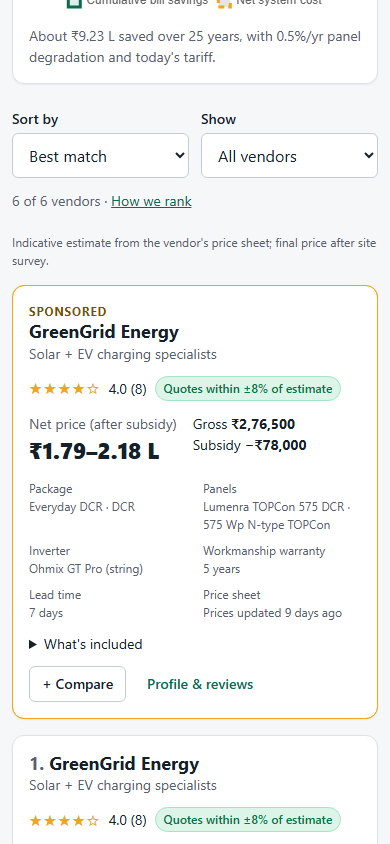
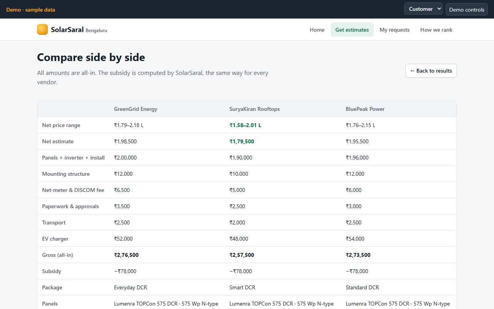

# SolarSaral — rooftop solar comparison (clickable demo)

A neutral comparison platform for rooftop solar in Bangalore. Customers describe their home once and see side-by-side, **all-in** estimates from every eligible vendor, computed from price sheets each vendor maintains. They choose up to 3 vendors for a site survey. Vendors do the installation; the platform never handles payment or fulfilment.

> **Demo — sample data.** Everything runs in the browser with no backend and no API keys. All vendors, brands, prices and reviews are fictional.

| Phone | Desktop |
|---|---|
|  |  |

More screenshots are in [docs/screenshots](docs/screenshots).

**Live demo:** https://blobea.github.io/solar-aggregrate/ — deployed by GitHub Pages on every push to `main` (`.github/workflows/deploy.yml`). Each visitor gets their own copy of the sample data in their browser.

## Run

Requires Node.js 20+ (built with Node 24 LTS).

```bash
npm install
npm run dev          # http://localhost:5173
npm run build        # → dist/
npm run preview      # serve dist/ on http://localhost:4173
```

## Test

```bash
npm test             # Vitest: engine + mock API (≈75 tests)
npx playwright install chromium   # first time only
npm run e2e          # builds, serves dist/, runs the full demo path + screenshots
npm run screenshots  # just regenerate docs/screenshots (390×844 and 1280×800)
npm run typecheck    # tsc over the // @ts-check JSDoc types (no TS build)
```

## Demo script (≈3 minutes)

Tip: **Demo controls** (top-right) can reset data, switch role, advance time and toggle the sponsored slot at any point.

1. **Home (15 s).** Show the value proposition and "How it works". Click **Try the demo customer**. This signs in with OTP `123456` and pre-fills 560102 (HSR Layout), a 60 m² RCC roof, 450 units/month, 5 kW sanctioned load, subsidy on, standard tier and a 7.4 kW EV charger.
2. **Results (45 s).** Point out the header (4 kW, ~504 units/month, savings, payback) and the 25-year chart. Then point out:
   - The **Sponsored** card on top. The same vendor also appears in its organic position.
   - SuryaKiran is cheapest but has a **red** accuracy badge (final quotes run ~25% over estimate).
   - Arka's **expired sheet** carries a warning and is ranked last, but not hidden.
   - BluePeak is "New — not enough data".
   - Open **What's included** on any card: fixed charges are always in, and the platform computes the subsidy.
   - Switch the sort between Price, Rating and Accuracy.
3. **Compare (20 s).** Tap **+ Compare** on three vendors, then **Compare**. You get a side-by-side table with line items.
4. **Request (20 s).** Click **Request surveys** and **Continue**. The consent box on the next screen is unticked. Submitting without ticking it shows an error; tick it and send.
5. **Vendor (30 s).** Switch the role to **Vendor**, then pick the first vendor you requested in the vendor dropdown. Go to **Leads**, open *Asha Demo*, and note the full configuration and the exact estimate shown. Log a **final quote** about 30–40% higher; the page shows the % gap. Optionally visit **Price sheet**: edit a cell, apply "+3% on all packages", save a new version, and Download/Upload Excel (invalid cells are highlighted).
6. **Advance time (10 s).** Demo controls → **Advance** on that request. It moves to *Installed*.
7. **Customer review (25 s).** Switch to **Customer** → **My requests** → **Leave a review**. Give 1s and 2s: each low score requires a reason code (DISCOM/subsidy-portal delays are shown but don't count against the vendor). Evidence is pre-filled from the invoice. Submit. The review shows as "Pending 72-hour check". Demo controls → **+3 days** publishes it.
8. **Dispute (20 s).** Switch to **Vendor** → **Reviews** → **Dispute** with a ground (e.g. *Factually false*).
9. **Ops (20 s).** Switch to **Ops** → **Disputes**. You see the review, the vendor's ground, and the evidence (estimate vs final quote, invoice). Choose **stands** with a note. Also glance at **Import** (the ±30% sanity check vs city median), **City rules** and the read-only **Estimates log**.
10. **Profile (15 s).** Open the vendor's public profile (Customer → results → *Profile & reviews*, or `#/vendors/<id>`). The rating has dropped, the accuracy window now includes the new quote, and the review shows "review stands".

## Architecture

```
app/            Vite root. Alpine.js UI, hash router, one folder per screen
  api/          async mock API over localStorage — the only data access path
  screens/<n>/  screen.html (template) + screen.js (Alpine component)
  lib/          formatting, Leaflet roof map, Chart.js savings chart, Tabulator grids, SheetJS I/O
  styles/       tokens.css (design tokens), base.css, components.css, screens.css
engine/         pure pricing engine (no DOM, no storage) + Vitest tests
data/seed/      JSON seed; dates like "@-40d" are resolved relative to "now" at seed time
tests/          unit/ (API smoke) and e2e/ (Playwright)
```

- **Engine** (`engine/`): sizing, estimate (slabs, structure, floors, distance, fixed, add-ons), platform-computed subsidy, savings with net metering and degradation, ranking (weights in `RANKING_WEIGHTS`), accuracy (median of the last 20 quotes), and reviews (Bayesian rating, milestone weights, recency decay, external reason codes, dispute states). It is pure and can run unchanged on a server.
- **API** (`app/api/`): function names and shapes mirror the future server. `store.js` is the only file that touches `localStorage`. Swapping to Supabase means replacing `store.js` (and `auth.js` for phone OTP) while keeping the exported functions.
- **Guarantees kept by the API:**
  - Customers only ever receive computed estimates, never a price sheet.
  - Every estimate shown is appended to the estimates log and never edited.
  - The sponsored slot never changes the organic order.
  - Negative reviews are never auto-hidden; only Ops can remove a review, via a dispute.

## Android (Capacitor)

`capacitor.config.json` is set up with `webDir: "dist"`. You need Android Studio and the Android SDK:

```bash
npm install @capacitor/android
npx cap add android
npm run build && npx cap sync
npx cap open android      # opens Android Studio → Run
```

Note: the roof map loads OpenStreetMap tiles, so the device needs internet access.

## Notes and limits

- Hard-coded auth: any valid 10-digit Indian mobile number, OTP always `123456`. The role switcher is for demo purposes only.
- Data lives in this browser's `localStorage`. Use **Reset demo data** to start over.
- Distances use straight-line distance between pincode centroids × 1.3 as a road-distance proxy.
- The BESCOM tariff, yield and subsidy values are editable in Ops → City rules. They are illustrative, not official.
